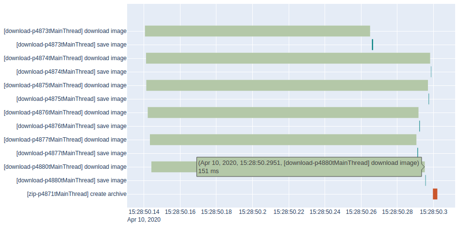

# PerformancePy

PerformancePy records performance of running python scripts to find bottlenecks.

When used in a single script which executes sequentially, it renders a simple waterfall diagram. The main use is, however, to measure execution times of scripts executed **in parallel** - whether in multiple **threats** or **processes**. The diagram rendered by PerformancePy helps to quickly inspect the execution times of individual blocks of code and find bottlenecks.

It is not meant to measure the performance of isolated code snippets down to microseconds - for that you can use [`timeit`](https://docs.python.org/3/library/timeit.html) module. PerformancePy works with somewhat more coarse values in the millisecond range. Pull requests are welcome.

The module is inspired by the **Performance** tools built into [Google Chrome](https://developers.google.com/web/tools/chrome-devtools/evaluate-performance) and [Firefox](https://developer.mozilla.org/en-US/docs/Tools/Performance).

## Usage

The module is designed to be a simple drop-in and doesn't need to be installed. Usage consists of two steps.

### Step 1 - generate performance records

Simply import it to all scripts that you want to measure. When the scripts are executed, PerformancePy automatically generates performance records in CSV format.

#### Basic usage

```python
from performancepy import PerformancePy

pp = PerformancePy('task group')
pp.start('executing task')
# Task execution
pp.dump()
```

#### Complete example

We want to visualize parallel download of multiple images and their compression in a zip file.

```python
import os
import sys
import multiprocessing
from zipfile import ZipFile

import requests

# Add PerformancePy module to PATH
sys.path.append('/path/to/performancepy')
from performancepy import PerformancePy


def download(url):
    # Tasks will be grouped in 'download',
    # performance records will be stored in the '/path/to/records' directory,
    # and time zone bias for GMT+8 is 480 minutes.
    pp_download = PerformancePy('download', '/path/to/records', 480)

    # Start 'download image' task
    pp_download.start('download image')
    image = requests.get(url)
    # The 'download image' task is done, dump its execution time
    pp_download.dump()

    # Start 'save image' task
    pp_download.start('save image')
    open(url.split('/')[-1], 'wb').write(image.content)
    # The 'save image' task is done, dump its execution time
    pp_download.dump()


if __name__ == '__main__':
    images = [
        'https://cdn.pixabay.com/photo/2015/02/28/15/48/monkey-653705_960_720.jpg',
        'https://cdn.pixabay.com/photo/2017/05/16/21/24/gorilla-2318998_960_720.jpg',
        'https://cdn.pixabay.com/photo/2018/09/25/21/32/chimpanzee-3703230_960_720.jpg',
        'https://cdn.pixabay.com/photo/2016/02/12/23/49/monkey-1197100_960_720.jpg',
        'https://cdn.pixabay.com/photo/2018/07/25/21/59/barbary-ape-3562358_960_720.jpg',
        'https://cdn.pixabay.com/photo/2015/05/15/14/42/monkeys-768641_960_720.jpg'
    ]

    processes = []
    for i, url in enumerate(images):
        p = multiprocessing.Process(target=download, args=(url,))
        processes.append(p)
        p.start()

    for p in processes:
        p.join()

    # Zipping the downloaded images is another task group called 'zip'
    pp_zip = PerformancePy('zip', '/path/to/records', 480)
    # Start 'zip' task and specify its color
    pp_zip.start('create archive', '#ca562c')
    with ZipFile('images.zip', 'w') as zip_archive:
        for file in os.listdir('.'):
            if not file.endswith('.jpg'):
                continue
            zip_archive.write(file)
    # The 'zip' task is done, dump its execution time
    pp_zip.dump()
```

There are now multiple performance records in the `/path/to/records` directory, one for each group (in this example, groups correspond to processes).

### Step 2

Produce a visual chart from the records generated in the first step. PerformancePy will save a HTML chart file in the records directory.

#### Example

```bash
python performancepy.py --directory "/path/to/records"
```

Executing this command generates interactive visualization of the task execution. Hovering the bar shows additional details, such as task start, duration in milliseconds, and its end.



## Dependencies

PerformancePy makes use of the following packages:

1. [Pandas](https://pandas.pydata.org/docs/getting_started/install.html)
2. [Plotly](https://plotly.com/python/getting-started/#installation)

## License

[MIT license](https://github.com/glenvorel/performancepy/blob/master/LICENSE)